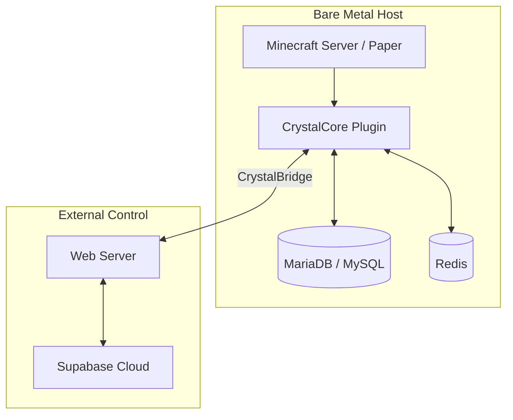

# 💎 CrystalCore

> **The logical heart and core engine of the CrystalTides Minecraft server.**


## 🌌 Overview

**CrystalCore** es el plugin central de **Paper/Spigot** que orquesta toda la lógica personalizada del proyecto. Desde la persistencia de perfiles hasta el puente de comunicación en tiempo real con la web, este componente es el encargado de que el mundo de Minecraft cobre vida y se integre perfectamente con el resto del ecosistema.

---

## 🌟 Core Features

- 🔄 **CrystalBridge Sync**: Procesamiento de comandos remotos desde la web mediante una cola asíncrona segura.
- 💾 **Native Persistence**: Sincronización de alta velocidad con **MariaDB/MySQL** local para perfiles y auditoría.
- ⚡ **Redis Pub/Sub**: Gestión de estado volátil y comunicación inter-servidor de baja latencia.
- 🏢 **Modular Architecture**: Sistema basado en módulos independientes (`Database`, `Redis`, `WebSocket`, `StaffStatus`).
- 📡 **Real-time WebSockets**: Canal de comunicación dedicado para actualizaciones instantáneas entre el juego y la web.

---

## 🏗️ Architecture & Placement

Al ser el componente más crítico del runtime del juego, CrystalCore opera en el entorno **Bare Metal** protegido:



> [!IMPORTANT]
> **Security Guard**: CrystalCore nunca expone sus servicios directamente a la red pública. Todo el acceso externo se realiza a través de túneles privados y el `web-server` de orquestación.

---

## 🛠️ Tech Stack

| Componente | Tecnología | Propósito |
| :--- | :--- | :--- |
| **Runtime** | Java 17+ (LTS) | Estabilidad y rendimiento de servidor |
| **API** | Paper / Spigot | Compatibilidad con plugins y optimizaciones de TPS |
| **Persistence** | MariaDB / MySQL | Almacenamiento de perfiles y auditoría |
| **Cache** | Redis | Cómputo temporal y sincronización rápida |
| **Build Tool** | [Maven](https://maven.apache.org/) | Gestión de dependencias y empaquetado |

---

## ⚙️ Configuración (config.yml)

El plugin se parametriza mediante un `config.yml` robusto. Aquí los bloques más importantes:

| Bloque | Variables Clave | Propósito |
| :--- | :--- | :--- |
| **database** | `host`, `port`, `user`, `password` | Conexión a la DB persistente |
| **redis** | `enabled`, `host`, `port` | Sincronización y caché volátil |
| **websocket** | `port`, `secret-token` | Seguridad del canal de bridge rápido |
| **modules** | `Profiles`, `WebBridge`, `Gacha` | Habilitación de funcionalidades específicas |

---

## 🚀 Desarrollo & Build

### 🛠️ Compilación

Para generar el archivo `.jar` listo para desplegar:

```bash
mvn clean package
```
El archivo resultante se encontrará en la carpeta `target/`.

---

## 🗺️ Roadmap de Evolución

- [ ] **Redis-Native Sync**: Migrar el 100% de la lógica de visibilidad de staff a Redis Pub/Sub.
- [ ] **Advanced Gacha Engine**: Motor de escaneo y recompensas totalmente parametrizable desde la web.
- [ ] **SpacetimeDB Bridge**: Exploración de replicación de estado in-game hacia SpacetimeDB para telemetría externa.

---

> [!NOTE]
> Este componente es el núcleo del servidor de juego de **CrystalTides**. Para una visión del ecosistema completo, consulta el [Project Overview](../../projects/README.md).
